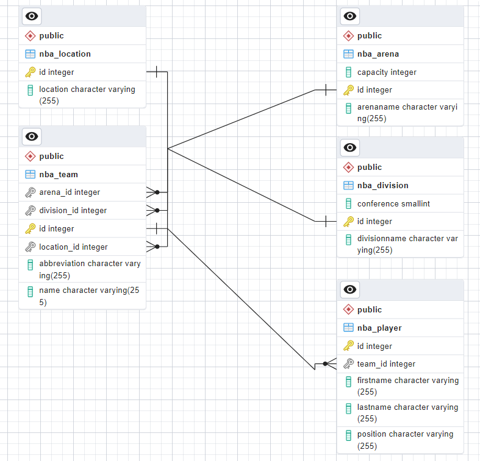

# DOCUMENTATION

## NBA PLAYER AND TEAM DATABASE
A description of our business idea

Our application is designed to scrape data from a website and to be enriched with data from an api. 

### Links and Names of Api's used in the assignment :

- https://www.balldontlie.io/api/v1/players - Players Api

- https://www.balldontlie.io/api/v1/teams - Teams Api

- https://www.wikipedia.org/National_Basketball_Association - NBA Table

The website www.wikipedia.org/National_Basketball_Association was 
scraped using the Jsoup library.

### Technologies used in the assignment :
1. Java version 21
2. Jsoup version 1.16.1.
3. Gson version 2.8.6
4. Junit version 5.13.2
5. Maven version 3.8.1
6. IntelliJ IDEA version 2023.2.3
7. Git version 2.33.0
8. GitHub version 3.10.2
9. Postgres version 13.4
10. Docker version 20.10.8
11. Docker-compose version 1.29.2
12. JPA version 2.2
13. Hibernate version 5.4.32
14. JQL version 1.0.0
15. Lombok version 1.18.20

### EER DIAGRAM

#### EDGE CASES

-  Performance Optimization 
- Scalability
- API Integration
- Database Integration

#### ERROR HANDLING 

- If the user enters a wrong input, the program will ask the user to enter the input again.
- IOException is handled by the program. 
- Null pointerException is handled by the program.
- ArrayIndexOutOfBoundsException is handled by the program.
- NumberFormatException is handled by the program.

#### POTENTIAL IMPROVEMENTS

1. More tests
2. Better UI
3. More data
4. Better error handling
5. Better documentation
6. Better code structure
7. Better code quality
8. Better code readability
9. Better code performance
10. Better code maintainability

